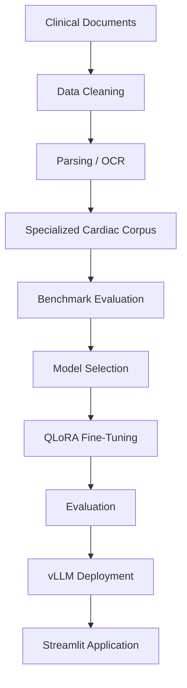
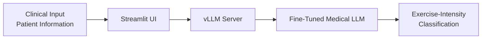

<div align="center">

# Clinical-LLM-ACSM

### Adapting Open-Source LLMs for Safe, Guideline-Based Cardiac Exercise Prescription

[](https://www.python.org/)
[](https://pytorch.org/)
[](https://huggingface.co/docs/transformers)
[](https://github.com/vllm-project/vllm)
[](https://streamlit.io/)
[](#limitations)
[](#license)

[**Full Report**](docs/project_report.pdf) ·
[**Report an Issue**](https://github.com/BilalJaouad/clinical-llm-acsm/issues) ·
[**Quick Start**](#quick-start)

</div>

> **Research disclaimer.** This project is for research and educational purposes only. It is **not a medical device** and must not replace professional clinical judgment, medical evaluation, or established cardiac rehabilitation protocols.

---

## Table of Contents

- [Overview](#overview)
- [Key Results](#key-results)
- [Clinical Context](#clinical-context)
- [Methodology](#methodology)
  - [1. Benchmark & Model Selection](#1-benchmark--model-selection)
  - [2. Corpus Preparation](#2-corpus-preparation)
  - [3. QLoRA Fine-Tuning](#3-qlora-fine-tuning)
- [System Architecture](#system-architecture)
- [Quick Start](#quick-start)
- [Repository Structure](#repository-structure)
- [Tech Stack](#tech-stack)
- [Limitations](#limitations)
- [Roadmap](#roadmap)
- [Citation](#citation)
- [Author](#author)
- [License](#license)

---

## Overview

This repository contains the methodology, data-processing pipelines, fine-tuning process, evaluation framework and deployment components used to adapt open-source Large Language Models (LLMs) for **safe cardiac exercise prescription** based on **American College of Sports Medicine (ACSM)** guidelines.

The project asks a focused question: **can specialized open-source medical LLMs provide more reliable and clinically aligned exercise-intensity recommendations than general-purpose models?**

**Objectives**

| # | Objective |
|---|-----------|
| 1 | Evaluate open-source LLMs on cardiac exercise-intensity classification. |
| 2 | Measure classification accuracy against four predefined clinical classes (A–D). |
| 3 | Detect potentially unsafe recommendations, in particular *severe over-prescription*. |
| 4 | Build a specialized cardiac rehabilitation corpus for model adaptation. |
| 5 | Fine-tune a medical foundation model with **QLoRA / PEFT**. |
| 6 | Deploy the adapted model behind an inference server and an interactive web app. |

---

## Key Results

| Metric | Value |
|--------|-------|
| Best foundation model | **BioMistral-7B** |
| Best prompting strategy | **Few-Shot (English)** |
| Accuracy on the 50-vignette benchmark | **88.0 %** |
| Severe over-prescription errors | **None observed** in this configuration |

> These figures come from a **synthetic benchmark** and must **not** be interpreted as evidence of clinical effectiveness or real-world safety. See [Limitations](#limitations).

---

## Clinical Context

Cardiovascular diseases require individualized and carefully controlled rehabilitation strategies. Exercise intensity must match the patient's clinical condition and risk profile, and clinicians rely on established guidelines such as those of the **ACSM** to determine it.

General-purpose open-source LLMs are not designed for deterministic clinical reasoning in this setting. They may produce unsafe recommendations, such as prescribing vigorous exercise to high-risk patients. This project investigates whether domain-specialized models can reduce that risk and stay more consistent with clinical guidelines.

---

## Methodology

### 1. Benchmark & Model Selection

A synthetic benchmark of **50 patient clinical vignettes** was built to assess exercise-intensity classification into four classes: **A, B, C, D**.

| Model | Type |
|-------|------|
| Llama-3-8B-Instruct | General-purpose |
| MEDITRON-7B | Medical |
| BioMistral-7B | Medical |

Models were compared under several prompting strategies, including Few-Shot English prompting. **BioMistral-7B** achieved the strongest results (88.0 % accuracy) and eliminated the severe over-prescription errors observed on the benchmark, and was therefore selected for fine-tuning.

### 2. Corpus Preparation

A specialized cardiac corpus was prepared from sources such as:

- Patient education workbooks
- Cardiac rehabilitation protocols
- Clinical practice guidelines
- Structured clinical documents
- Complex medical tables and flowcharts

**Processing tools**

| Tool | Purpose |
|------|---------|
| [Camelot](https://camelot-py.readthedocs.io/) | Extraction of complex multi-column clinical tables (e.g. *CPG STEMI 2019*). |
| [Tesseract OCR](https://github.com/tesseract-ocr/tesseract) | Text extraction from documents whose content is embedded in vector images and flowcharts. |

The pipeline removes irrelevant formatting and noise while preserving clinically relevant information.

### 3. QLoRA Fine-Tuning

The selected model, **BioMistral-7B-BnB.4**, was loaded in 4-bit and adapted with parameter-efficient fine-tuning (PEFT) using QLoRA, which makes it possible to train a 7B model on modest hardware.

| Parameter | Value |
|-----------|-------|
| Method | QLoRA |
| Framework | PEFT |
| Quantization | 4-bit (BitsAndBytes) |
| GPU | Google Colab T4 (16 GB) |
| LoRA rank (`r`) | 16 |
| LoRA alpha | 32 |
| Target modules | `q_proj`, `k_proj`, `v_proj`, `o_proj` |

### Evaluation Criteria

- Classification accuracy and correct exercise-intensity classification
- Identification of potentially unsafe recommendations
- Severe over-prescription errors
- Comparison across prompting strategies
- Comparison between foundation models and the adapted model

---

## System Architecture

### End-to-end pipeline



### Inference flow



---

## Quick Start

### Prerequisites

- Python **3.9+**
- CUDA-compatible GPU with up-to-date NVIDIA drivers
- Git

### Installation

```bash
# 1. Clone the repository
git clone https://github.com/BilalJaouad/clinical-llm-acsm.git
cd clinical-llm-acsm

# 2. Create and activate a virtual environment
python -m venv .venv
source .venv/bin/activate        # Linux / macOS
# .venv\Scripts\activate         # Windows

# 3. Install dependencies
pip install -r requirements.txt
```

### Serve the model with vLLM

```bash
python -m vllm.entrypoints.openai.api_server \
  --model <path-or-hf-id-of-the-fine-tuned-model> \
  --port 8000
```

### Launch the web application

```bash
streamlit run app/app.py   # adjust the path to your entry point
```

---

## Repository Structure

```text
clinical-llm-acsm/
├── docs/
│   └── project_report.pdf     # Full project report
├── data/
│   ├── raw/                   # Source documents
│   └── processed/             # Cleaned corpus and benchmark data
├── notebooks/                 # Experiments, evaluation, fine-tuning
├── src/                       # Core library code
├── scripts/                   # Utility and pipeline scripts
├── app/                       # Streamlit application
├── requirements.txt
├── README.md
└── .gitignore
```

> The exact layout may vary with the implementation.

---

## Tech Stack

| Category | Technologies |
|----------|--------------|
| Language & ML | Python, PyTorch, Hugging Face Transformers |
| Adaptation | PEFT, QLoRA, BitsAndBytes |
| Data extraction | Camelot, Tesseract OCR |
| Serving & UI | vLLM, Streamlit |
| Experimentation | Google Colab |

---

## Limitations

- **Synthetic evaluation data.** The benchmark has only 50 synthetic vignettes; results may not transfer to real clinical populations.
- **Limited model coverage.** Only a small number of open-source models were evaluated.
- **No clinical validation.** Benchmark performance is not validation for real-world decision-making.
- **Model reliability.** LLMs can produce incorrect or inconsistent outputs, including outside the training and evaluation distribution.
- **Human oversight required.** Any clinical use would need rigorous validation, safeguards and qualified supervision.

---

## Roadmap

- [ ] Expand the benchmark with larger, more diverse patient cases
- [ ] Add further cardiac rehabilitation scenarios
- [ ] Evaluate additional open-source medical LLMs
- [ ] Test multilingual prompting and fine-tuning strategies
- [ ] Perform deeper error analysis
- [ ] Evaluate robustness to ambiguous or incomplete patient information
- [ ] Improve interpretability and traceability of outputs
- [ ] Validate on clinically reviewed datasets
- [ ] Explore stronger safety mechanisms for deployment

---

## Citation

If you use this work, please cite:

```bibtex
@misc{jaouad2026clinicalllmacsm,
  author       = {Jaouad, Bilal},
  title        = {Adapting Open-Source LLMs for Safe Cardiac Exercise Prescription},
  year         = {2026},
  howpublished = {\url{https://github.com/BilalJaouad/clinical-llm-acsm}}
}
```

---

## Author

**Bilal Jaouad**
GitHub: [@BilalJaouad](https://github.com/BilalJaouad)

---


---

<div align="center">

**Disclaimer** — The models, code, datasets and outputs in this repository are not intended for medical diagnosis, treatment or autonomous clinical decision-making. Any cardiac exercise prescription must be determined by a qualified healthcare professional using established guidelines and patient-specific assessment.

</div>
